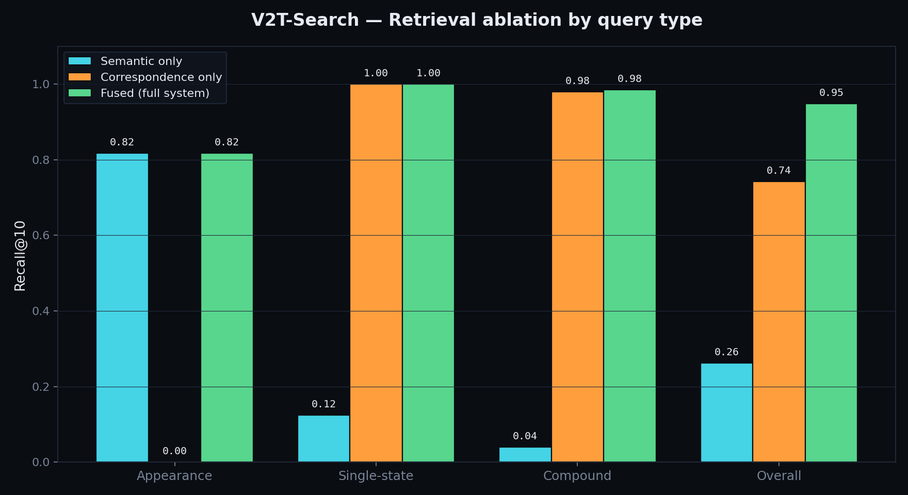

# V2T-Search

**Compound retrieval for multi-camera driving video.** A retrieval system that answers compound
behavioral queries — like *"an anxious driver changing lanes"* or *"a driver on the phone while
turning"* — by pairing the in-cabin camera with the road camera. These are queries that no single
frame embedding can represent, because driver state, road context, and vehicle maneuver come from
different cameras at the same moment.

The project's thesis is not "I used models." It's **"I designed a retrieval architecture and measured
every layer of it."**

> **Headline result:** on compound behavioral queries, semantic-only retrieval achieves Recall@10 =
> **0.04**; the full fused system achieves **0.99**. Overall Recall@10 across all query types rises
> from 0.26 (semantic baseline) to **0.95** (full system).



---

## What problem this solves

Standard video search embeds frames with a vision-language model and retrieves the nearest matches
to a text query. This works for appearance (*"a red truck"*) but fails for compound behavioral
queries (*"an anxious driver changing lanes"*), because:

- driver emotion comes from the **in-cabin** camera,
- road/traffic context comes from the **forward** camera,
- and no single frame embedding represents both simultaneously.

V2T-Search splits the work across purpose-built retrieval layers, fuses them, and measures each
layer's contribution.

## Architecture

| Layer | Signal | Implementation |
|---|---|---|
| 1 · Semantic | Appearance | SigLIP 2 embeddings of YOLO26-detected object crops in Qdrant |
| 2 · Structured events | Driver / road state | AIDE human-annotated per-clip labels as timestamped events in PostgreSQL |
| 3 · Cross-camera correspondence | Multi-camera co-occurrence | SQL self-join finding clips where in-cabin and front conditions co-occur — **the differentiator** |
| Planner | Query understanding | Dual-mode: deterministic rule-based (for eval) + LLM/Claude (for natural language) |

Results from the active layers are combined with **Reciprocal Rank Fusion**.

```
AIDE dataset ─► Redis Streams (idempotent, checkpointed ingestion)
            ─► workers: YOLO26 + SigLIP 2 + label→event extraction
            ─► PostgreSQL (assets, clips, events) + Qdrant (objects)
            ─► FastAPI: planner → retrieval layers → RRF fusion → /search
            ─► Web UI: synchronized quad-camera player + "why matched" panel
```

## Dataset

[AIDE](https://github.com/ydk122024/AIDE) (ICCV 2023, Fudan University) — 2,898 driving samples, each
a 3-second clip from **four synchronized cameras** (front, left, right, in-cabin), annotated with four
per-clip perception labels (driver behavior, driver emotion, traffic context, vehicle condition).

## Results

Three configurations evaluated on 48 hand-verified queries:

| Query type | Semantic only | Correspondence only | Fused |
|---|---|---|---|
| Appearance (n=12) | **0.82** | 0.00 | 0.82 |
| Single-state (n=16) | 0.13 | 1.00 | **1.00** |
| Compound (n=20) | 0.04 | 0.98 | **0.99** |
| **Overall (n=48)** | 0.26 | 0.74 | **0.95** |

*(Recall@10. Each layer earns its place: semantic wins appearance, the structured layer wins
behavioral queries, only the fused system is strong across all types.)*

## Evaluation methodology (read this)

Ground truth is derived from AIDE's human-annotated per-clip labels: for *"anxious driver changing
lanes,"* relevant clips are those a human labeled with the corresponding emotion and maneuver.

The correspondence layer and the compound-query ground truth draw on the **same annotation source**,
so the correspondence configuration scores high on compound queries **by construction**. The
informative finding is the *gap*: **semantic-only retrieval fails on compound behavioral queries
(0.04)** because driver state and road maneuver aren't encoded in frame embeddings, while the
structured layer recovers them. Appearance queries provide the counterbalance — there semantic
succeeds and the structured layer contributes nothing — confirming each layer earns its place.

## Honest limitations

- **Co-occurrence, not temporal sequencing.** AIDE provides clip-level labels, so cross-camera
  correspondence is modeled as same-clip co-occurrence. The join generalizes to temporal-sequence
  patterns when sub-clip event timestamps are available.
- **Keypoint-derived events were tested and dropped.** AIDE's pre-extracted face keypoints had mean
  confidence < 0.05; derived blink/gaze events were unreliable, so the structured layer relies on the
  human-annotated task labels. (Code retained, disabled.)
- **X-CLIP temporal reranker scoped but not built.** The fused system already reaches Recall@10 ≥
  0.95, leaving no measurable headroom for a reranker on this dataset. Retained as future work for
  larger corpora.
- **Index-time, not query-time.** Like any search engine, the system serves queries against a
  prebuilt index. The semantic layer generalizes to new videos via the same ingestion pipeline; the
  correspondence layer requires multi-camera synchronized input with behavioral annotations.

## Future work — extending to new datasets

Dataset support is currently AIDE-specific (folder layout, label keys, and the 21-term event
vocabulary are hard-coded). The system is designed to extend cleanly along three paths:

- **More AIDE-format data** works today with no code changes — ingestion is idempotent
  (content-hash deduplication), so re-running the pipeline indexes only new clips.
- **A different multi-camera dataset** would be handled by a planned `DatasetAdapter` interface that
  isolates dataset-specific loading and label-mapping. Adding a dataset then means implementing one
  adapter (`iter_samples` + `extract_events`) rather than touching the retrieval pipeline, which
  operates on an internal format.
- **Arbitrary single-camera video** can use the semantic layer through the existing ingestion path
  (frame extraction → YOLO → SigLIP → Qdrant). The cross-camera correspondence layer requires
  synchronized multi-camera input with behavioral annotations *by design* — it cannot apply to a
  single uncalibrated stream, and generating the driver/road labels for unlabeled video would require
  separately trained behavior classifiers (out of scope here).

This separation — semantic retrieval generalizes, structured correspondence requires the right input
shape — is a deliberate property of the architecture, not an accident of the current implementation.

## Tech stack

Python 3.12 · FastAPI · PostgreSQL 16 · Qdrant · Redis Streams · SigLIP 2 · YOLO26 · Anthropic Claude
API · Docker Compose

## Running it

**Prerequisites:** Docker, Python 3.12, the AIDE dataset extracted to `data/aide/AIDE_Dataset/`.

```bash
# 1. Infrastructure
docker compose up -d            # Postgres + Redis + Qdrant

# 2. Python env
python -m venv .venv && source .venv/bin/activate
pip install -r requirements.txt
cp .env.example .env            # add your ANTHROPIC_API_KEY if using the LLM planner

# 3. Ingest (see guides for the staged pipeline)
python services/worker/aide_loader.py          # build the manifest
python -m scripts.ingest_labels                 # task-label events
python -m scripts.ingest_objects                # YOLO + SigLIP object embeddings (long)

# 4. Evaluate
python -m scripts.build_eval_set                # build eval queries + ground truth
python -m scripts.ablation                      # run the ablation
python -m scripts.plot_ablation                 # render the chart

# 5. Serve
uvicorn apps.api.search_api:app --port 8002
#   http://localhost:8002          dashboard
#   http://localhost:8002/explore  live search + quad-camera player
```

## Demo

[link to your 60–90s demo video]

## License & credits

Built on the AIDE dataset (MIT license). Project code: [your license].
Author: [your name] · [your portfolio / GitHub]
